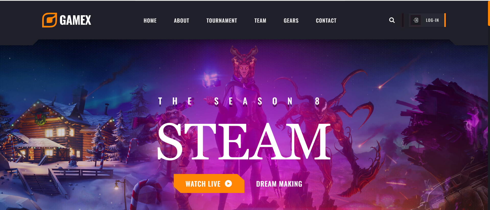

# GameX Landing Page

A visually engaging and modern landing page for GameX, designed to attract gamers and showcase features, characters, and events. Built with HTML, CSS, and JavaScript for a smooth, interactive experience.

## Features

- Hero section with banner and call-to-action
- About section with images and details
- Character showcase
- Gallery of in-game moments
- Team members and winners sections
- Newsletter subscription
- Responsive design for all devices
- Modern UI and smooth animations

## Tech Stack

- HTML5
- CSS3
- JavaScript (ES6+)

## Getting Started

1. **Clone the repository:**

   ```bash
   git clone https://github.com/raorohit22/GameX-landing-page.git
   cd GameX-landing-page
   ```

2. **Open `index.html` in your browser**
   - No build step required. All assets are included.

## Folder Structure

- `assets/css` – Stylesheets
- `assets/js` – JavaScript files
- `assets/images` – Images and graphics

## Screenshots



## License

This project is for educational purposes only and is not affiliated with any official game or company.
